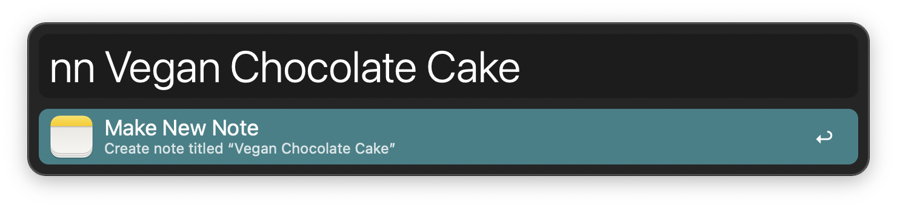

#  Notes Alfred Workflow

Search and create notes in Notes.app

[⤓ Install on the Alfred Gallery](https://alfred.app/workflows/alfredapp/notes)

## Usage

Search notes via the `ns` keyword.

* <kbd>↩&#xFE0E;</kbd> Open note in the Notes app.
* <kbd>⌃</kbd><kbd>↩&#xFE0E;</kbd> Delete note.
* <kbd>⌘</kbd><kbd>⌥</kbd><kbd>⌃</kbd><kbd>↩&#xFE0E;</kbd> Force cache flush.

Create a new note from within Alfred via the `nn` keyword.

Quickly open the last modified note via the `nl` keyword.

Configure the [Hotkeys](https://www.alfredapp.com/help/workflows/triggers/hotkey/) for faster triggering.
